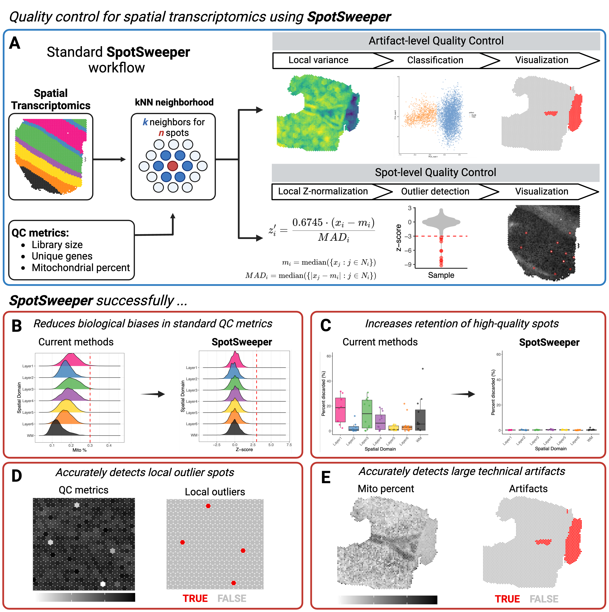

<!-- README.md is generated from README.Rmd. Please edit that file -->

# SpotSweeper

<!-- badges: start -->

[](https://lifecycle.r-lib.org/articles/stages.html#experimental)
[](https://codecov.io/gh/MicTott/SpotSweeper)
<!-- badges: end -->

`SpotSweeper` is a package developed for spatially-aware quality control
(QC) methods for the detection, visualization, and removal of both local
outliers and large artifacts in spot-based spatial transcriptomics data,
such as 10x Genomics `Visium`, using standard QC metrics.

The package is currently under development and is not yet available on
Bioconductor. The package is currently in the experimental stage of
development. If you experience an issues user the package, please open
an issue on the [GitHub
repository](https://github.com/MicTott/SpotSweeper/issues).

To find more information, please visit the [documentation
website](http://MicTott.github.io/SpotSweeper).



## Installation instructions

You can install the latest version of `SpotSweeper` from Bioconductor
with the following code:

``` r
if (!requireNamespace("BiocManager", quietly = TRUE)) {
    install.packages("BiocManager")
}

BiocManager::install("SpotSweeper")
```

The latest development version can be installed from
[GitHub](https://github.com/MicTott/SpotSweeper) using the following:

``` r
if (!require("devtools")) install.packages("devtools")
remotes::install_github("MicTott/SpotSweeper")
```

## Input data format

In the examples below, we assume the input data are provided as a
[SpatialExperiment](https://github.com/drighelli/SpatialExperiment)
(SPE) object. The outputs for spot-level outliers and artifacts are
stored in the `colData` of the SPE object.

## Tutorials

A detailed tutorial is available in the package vignette from
Bioconductor. A direct link to the tutorial / package vignette is
available
[here](https://mictott.github.io/SpotSweeper/articles/getting_started.html).

## Development tools

- Continuous code testing is possible thanks to [GitHub
  actions](https://www.tidyverse.org/blog/2020/04/usethis-1-6-0/)
  through `BiocStyle::Biocpkg('biocthis')`.
- The [documentation website](http://MicTott.github.io/SpotSweeper) is
  automatically updated thanks to `BiocStyle::CRANpkg('pkgdown')`.
- The code is styled automatically thanks to
  `BiocStyle::CRANpkg('styler')`.
- The documentation is formatted thanks to
  `BiocStyle::CRANpkg('devtools')` and `BiocStyle::CRANpkg('roxygen2')`.

This package was developed using `BiocStyle::Biocpkg('biocthis')`.
